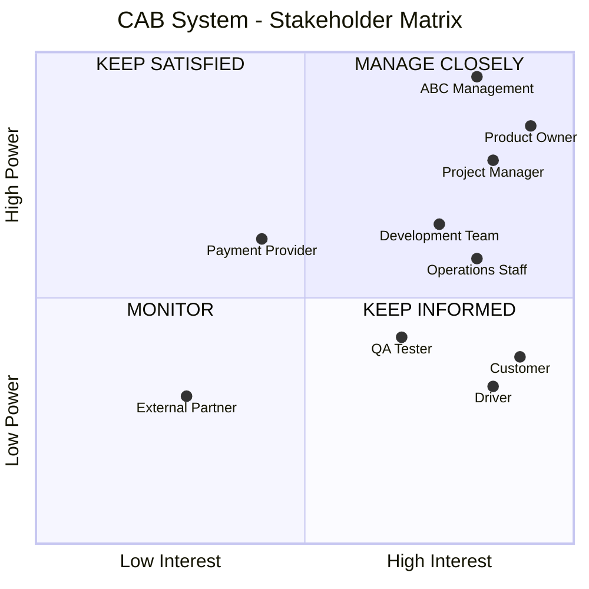

# Software Requirement Specification (SRS)
## CAB System – Nền tảng đặt xe
1. Tóm tắt
###  Giới thiệu
- **Mục tiêu**: Xây dựng hệ thống đặt xe trực tuyến mới, khắc phục hạn chế của hệ thống hiện tại, có khả năng mở rộng và phát triển lâu dài.
- **Thời gian triển khai**: 7 tuần.
- **Khách hàng**: Công ty ABC – doanh nghiệp cung cấp dịch vụ đặt xe trực tuyến.

###  Phạm vi hệ thống
Hệ thống phục vụ ba nhóm người dùng chính:
- **Khách hàng**: Đăng ký, đăng nhập, đặt xe, theo dõi chuyến đi, thanh toán, đánh giá.
- **Tài xế**: Quản lý hồ sơ, phương tiện, trạng thái, nhận/chấp nhận chuyến, cập nhật tiến trình chuyến đi.
- **Nhân viên vận hành**: Quản trị khách hàng, tài xế, phương tiện, chuyến đi, xử lý sự cố, báo cáo.

###  Yêu cầu chức năng
- **Quản lý tài khoản**: Đăng ký, đăng nhập, cập nhật thông tin cho khách hàng và tài xế.
- **Đặt xe**: Nhập điểm đón/điểm đến, chọn loại xe, gửi yêu cầu.
- **Phân công tài xế**: Tìm tài xế phù hợp dựa trên vị trí và trạng thái, xử lý khi tài xế từ chối hoặc không phản hồi.
- **Theo dõi chuyến đi**: Hiển thị trạng thái chuyến, thời gian dự kiến, thông tin tài xế.
- **Thanh toán**: Tính cước, hỗ trợ tiền mặt và thanh toán điện tử, tích hợp nhà cung cấp bên ngoài.
- **Thông báo**: Gửi thông báo cho khách hàng và tài xế về các sự kiện quan trọng.
- **Quản trị**: Giao diện quản lý, phân quyền, báo cáo hoạt động.

###  Yêu cầu phi chức năng
- **Hiệu năng**: Hoạt động ổn định khi tải cao, mở rộng độc lập từng thành phần.
- **Triển khai**: Cho phép bổ sung chức năng mới mà không ảnh hưởng hệ thống hiện tại.
- **Bảo mật**: Xác thực, phân quyền, bảo vệ dữ liệu cá nhân, lưu vết thao tác.

###  Quy tắc nghiệp vụ
- Ưu tiên tài xế gần khách hàng và sẵn sàng.
- Tự động tìm tài xế khác nếu người đầu tiên từ chối hoặc không phản hồi.
- Không lưu thông tin nhạy cảm của thẻ/tài khoản thanh toán trong hệ thống.
- Chính sách xử lý khi thanh toán thất bại hoặc mất kết nối mạng cần được xác định.

###  Các điểm cần làm rõ
- Cách tính cước chi tiết.
- Tiêu chí ưu tiên tài xế.
- Thời gian phản hồi của tài xế.
- Chính sách hủy chuyến.
- Thời gian lưu trữ dữ liệu.

###  Kỳ vọng của khách hàng
- Một nền tảng đặt xe lâu dài, linh hoạt, hỗ trợ đầy đủ quy trình từ đặt xe đến thanh toán và đánh giá.
- Doanh nghiệp có thể phối hợp nội bộ và theo dõi hoạt động qua hệ thống.
- Business Analyst xác định rõ phạm vi, tác nhân, quy trình, yêu cầu chức năng/phi chức năng, quy tắc nghiệp vụ, ngoại lệ và các điểm chưa rõ để xác nhận với khách hàng.

2. Stakeholder Matrix:

3. Business Rules - Quy tắc nghiệp vụ

Customer Management
| ID       | Business Rule                                                      | Nguồn yêu cầu     |
| -------- | ------------------------------------------------------------------ | ----------------- |
| **BR01** | Khách hàng phải có tài khoản hợp lệ để sử dụng dịch vụ đặt xe.     | Quản lý tài khoản |
| **BR02** | Khách hàng phải cung cấp điểm đón, điểm đến và loại xe khi đặt xe. | Đặt xe            |
| **BR03** | Khách hàng chỉ được theo dõi chuyến sau khi yêu cầu được xác nhận. | Theo dõi chuyến   |
| **BR04** | Khách hàng chỉ được đánh giá sau khi chuyến xe hoàn thành.         | Đánh giá          |

Driver Management
| ID       | Business Rule                                                                                                |
| -------- | ------------------------------------------------------------------------------------------------------------ |
| **BR05** | Chỉ tài xế có trạng thái sẵn sàng mới được nhận chuyến.                                                      |
| **BR06** | Hệ thống ưu tiên tài xế gần khách hàng và đang sẵn sàng.                                                     |
| **BR07** | Tài xế phải phản hồi yêu cầu chuyến trong thời gian quy định.                                                |
| **BR08** | Nếu tài xế từ chối chuyến, hệ thống phải tìm tài xế phù hợp tiếp theo.                                       |
| **BR09** | Nếu tài xế không phản hồi trong thời gian quy định, hệ thống phải coi yêu cầu là timeout và tìm tài xế khác. |
| **BR10** | Chuyến xe chỉ được xác nhận khi tài xế chấp nhận yêu cầu.                                                    |

Booking Management
| ID       | Business Rule                                                                      |
| -------- | ---------------------------------------------------------------------------------- |
| **BR11** | Mỗi yêu cầu đặt xe phải xác định được khách hàng, điểm đón, điểm đến và loại xe.   |
| **BR12** | Một yêu cầu đặt xe chỉ được chuyển thành chuyến khi có tài xế chấp nhận.           |
| **BR13** | Nếu không có tài xế phù hợp, hệ thống phải thông báo cho khách hàng.               |
| **BR14** | Hệ thống phải duy trì trạng thái của yêu cầu/chuyến xe trong suốt quá trình xử lý. |

Payment Management
| ID       | Business Rule                                                                                                |
| -------- | ------------------------------------------------------------------------------------------------------------ |
| **BR15** | Hệ thống phải hỗ trợ thanh toán bằng tiền mặt và thanh toán điện tử.                                         |
| **BR16** | Thanh toán điện tử phải được thực hiện thông qua nhà cung cấp thanh toán bên ngoài.                          |
| **BR17** | Hệ thống không được lưu thông tin nhạy cảm của thẻ hoặc tài khoản thanh toán.                                |
| **BR18** | Khi thanh toán thất bại, hệ thống phải ghi nhận trạng thái thất bại và thực hiện chính sách xử lý tương ứng. |

4. Module
CAB SYSTEM
│
├── 1. Customer Management
│   ├── Registration / Login
│   ├── Profile Management
│   ├── Booking
│   ├── Trip Tracking
│   └── Rating
│
├── 2. Driver Management
│   ├── Driver Profile
│   ├── Vehicle Management
│   ├── Driver Availability
│   ├── Driver Location
│   ├── Ride Acceptance
│   └── Trip Progress
│
├── 3. Booking & Dispatch Management
│   ├── Create Booking
│   ├── Find Driver
│   ├── Driver Assignment
│   ├── Reassignment
│   └── Booking Status
│
├── 4. Payment Management
│   ├── Fare Calculation
│   ├── Cash Payment
│   ├── Electronic Payment
│   └── Payment Failure
│
└── 5. Operation & Administration
    ├── Customer Management
    ├── Driver Management
    ├── Vehicle Management
    ├── Trip Management
    ├── Incident Management
    ├── Permission Management
    └── Reporting

5. Thiết kế Business Requirement
BR01 – Customer Registration & Account

Module: Customer Management

Business Objective:
Cho phép khách hàng tạo và sử dụng tài khoản để sử dụng dịch vụ CAB.

Actor: Customer

Business Requirement:
Hệ thống phải cho phép khách hàng đăng ký, đăng nhập và cập nhật thông tin tài khoản.

Business Rules:

Khách hàng phải có tài khoản hợp lệ để đặt xe.
Tài khoản không hoạt động không được phép tạo yêu cầu đặt xe.

Customer
   ↓
Register
   ↓
Provide Information
   ↓
System validates information
   ↓
Create Account
   ↓
Login
   ↓
Account Active

BR02 – Create Booking

Module: Customer Management / Booking Management

Business Objective:
Cho phép khách hàng tạo yêu cầu đặt xe.

Actor: Customer

Business Requirement:
Hệ thống phải cho phép khách hàng nhập điểm đón, điểm đến và loại xe để gửi yêu cầu đặt xe.

Business Rules:

Khách hàng phải đăng nhập.
Điểm đón phải được xác định.
Điểm đến phải được xác định.
Loại xe phải được lựa chọn.

Customer
   ↓
Enter Pickup
   ↓
Enter Destination
   ↓
Select Vehicle Type
   ↓
Submit Booking
   ↓
System creates Booking

BR03 – Driver Assignment

Module: Driver Management / Booking & Dispatch

Business Objective:
Tự động tìm và phân công tài xế phù hợp.

Actor: System

Business Requirement:
Hệ thống phải tìm tài xế dựa trên vị trí và trạng thái sẵn sàng.

Business Rules:

Chỉ tài xế Available mới được lựa chọn.
Ưu tiên tài xế gần khách hàng.
Tài xế phải phản hồi trong thời gian quy định.
Từ chối → tìm tài xế khác.
Timeout → tìm tài xế khác.

Booking Created
      ↓
Find Available Drivers
      ↓
Calculate / Compare Distance
      ↓
Select Nearest Driver
      ↓
Send Ride Request
      ↓
 ┌────┴─────────────┐
 ↓                  ↓
Accept          Reject / Timeout
 ↓                  ↓
Confirm Trip    Find Next Driver

BR04 – Trip Management

Module: Booking & Dispatch / Driver Management

Business Objective:
Quản lý toàn bộ vòng đời của chuyến xe.

Business Requirement:
Hệ thống phải cho phép tài xế cập nhật tiến trình chuyến và cho phép khách hàng theo dõi trạng thái.

Flow:
Assigned
   ↓
Driver Arriving
   ↓
Driver Arrived
   ↓
Trip Started
   ↓
Trip In Progress
   ↓
Trip Completed

BR05 – Payment Management

Module: Payment Management

Business Objective:
Cho phép khách hàng thanh toán chi phí chuyến xe.

Business Requirement:
Hệ thống phải hỗ trợ thanh toán tiền mặt và thanh toán điện tử thông qua nhà cung cấp bên ngoài.

Business Rules:

Không lưu dữ liệu nhạy cảm của thẻ/tài khoản.
Payment Provider xử lý thanh toán điện tử.
Hệ thống phải nhận kết quả thanh toán.
Thanh toán thất bại phải được ghi nhận.

Trip Completed
      ↓
Calculate Final Fare
      ↓
Select Payment Method
      ↓
 ┌────┴──────────┐
 ↓               ↓
Cash       Electronic Payment
 ↓               ↓
Record       Payment Provider
Payment          ↓
             Payment Result
                  ↓
           Success / Failed

