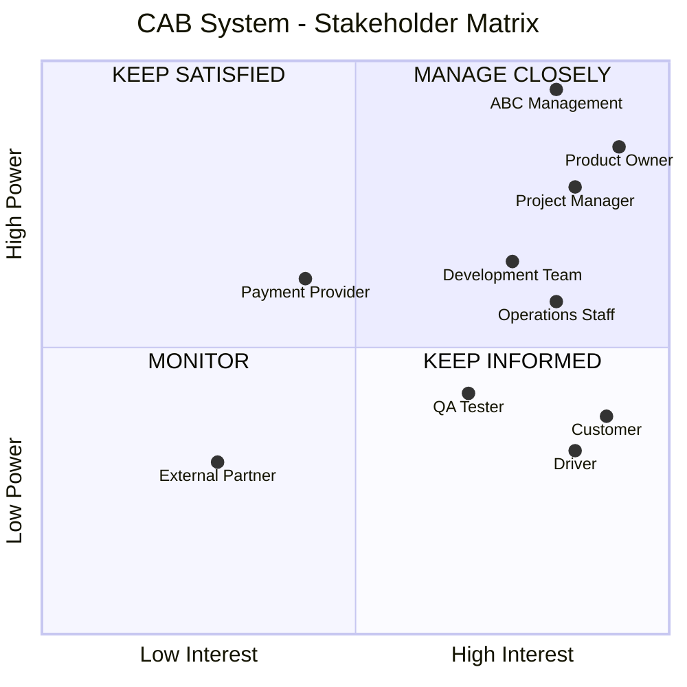
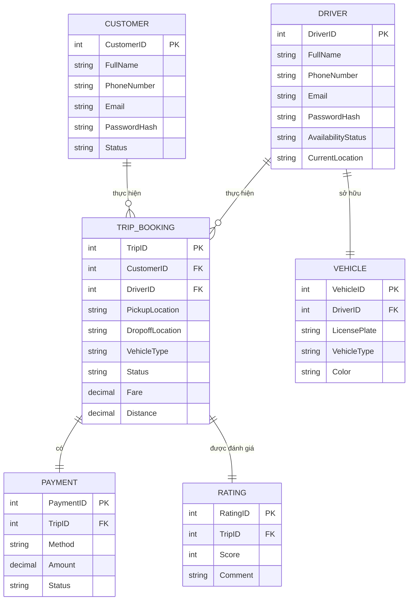

# Software Requirement Specification (SRS)
## CAB System – Nền tảng đặt xe


## 1. Xác định Stakeholder

| Stakeholder                     | Role                    | Responsibilities & Concerns                                                                                                                  |
| ------------------------------- | ----------------------- | -------------------------------------------------------------------------------------------------------------------------------------------- |
| **Ban lãnh đạo (Ban giám đốc)** | Sponsor / Project Owner | Kỳ vọng xây dựng nền tảng CAB mới phục vụ số lượng lớn người dùng. Cần báo cáo về doanh thu, tỷ lệ hoàn thành/hủy chuyến và hiệu quả tài xế. |
| **Khách hàng**                  | End-User                | Đăng ký, đặt xe, chọn loại xe, theo dõi chuyến đi, xem số tiền phải trả và đánh giá chuyến đi.                                               |
| **Tài xế**                      | End-User                | Đăng ký hồ sơ, cập nhật trạng thái sẵn sàng, nhận thông báo, chấp nhận/từ chối chuyến và cập nhật trạng thái chuyến đi.                      |
| **Nhân viên vận hành**          | Admin                   | Quản lý khách hàng, tài xế, phương tiện; hỗ trợ xử lý lỗi và tra cứu lịch sử giao dịch.                                                      |
| **Nhà cung cấp thanh toán**     | External System         | Tích hợp và xử lý các giao dịch thanh toán điện tử.                                                                                          |
| **Business Analyst**            | Project Team            | Xác định phạm vi, quy trình, yêu cầu và làm rõ các quy tắc nghiệp vụ như tính cước, tiêu chí ưu tiên và thời gian phản hồi.                  |
| **Nhóm phát triển (Dev Team)**  | Project Team            | Xây dựng hệ thống ổn định, có khả năng mở rộng độc lập từng thành phần khi tải hệ thống tăng.                                                |


## 2. Stakeholder Matrix:



## 3. Business Rules - Quy tắc nghiệp vụ

Customer Management
| ID       | Business Rule                                                      | Nguồn yêu cầu     |
| -------- | ------------------------------------------------------------------ | ----------------- |
| **BR01** | Khách hàng phải có tài khoản hợp lệ để sử dụng dịch vụ đặt xe.     | Quản lý tài khoản |
| **BR02** | Khách hàng phải cung cấp điểm đón, điểm đến và loại xe khi đặt xe. | Đặt xe            |
| **BR03** | Khách hàng chỉ được theo dõi chuyến sau khi yêu cầu được xác nhận. | Theo dõi chuyến   |
| **BR04** | Khách hàng chỉ được đánh giá sau khi chuyến xe hoàn thành.         | Đánh giá          |

Driver Management
| ID       | Business Rule                                                                                                |
| -------- | ------------------------------------------------------------------------------------------------------------ |
| **BR05** | Chỉ tài xế có trạng thái sẵn sàng mới được nhận chuyến.                                                      |
| **BR06** | Hệ thống ưu tiên tài xế gần khách hàng và đang sẵn sàng.                                                     |
| **BR07** | Tài xế phải phản hồi yêu cầu chuyến trong thời gian quy định.                                                |
| **BR08** | Nếu tài xế từ chối chuyến, hệ thống phải tìm tài xế phù hợp tiếp theo.                                       |
| **BR09** | Nếu tài xế không phản hồi trong thời gian quy định, hệ thống phải coi yêu cầu là timeout và tìm tài xế khác. |
| **BR10** | Chuyến xe chỉ được xác nhận khi tài xế chấp nhận yêu cầu.                                                    |

Booking Management
| ID       | Business Rule                                                                      |
| -------- | ---------------------------------------------------------------------------------- |
| **BR11** | Mỗi yêu cầu đặt xe phải xác định được khách hàng, điểm đón, điểm đến và loại xe.   |
| **BR12** | Một yêu cầu đặt xe chỉ được chuyển thành chuyến khi có tài xế chấp nhận.           |
| **BR13** | Nếu không có tài xế phù hợp, hệ thống phải thông báo cho khách hàng.               |
| **BR14** | Hệ thống phải duy trì trạng thái của yêu cầu/chuyến xe trong suốt quá trình xử lý. |

Payment Management
| ID       | Business Rule                                                                                                |
| -------- | ------------------------------------------------------------------------------------------------------------ |
| **BR15** | Hệ thống phải hỗ trợ thanh toán bằng tiền mặt và thanh toán điện tử.                                         |
| **BR16** | Thanh toán điện tử phải được thực hiện thông qua nhà cung cấp thanh toán bên ngoài.                          |
| **BR17** | Hệ thống không được lưu thông tin nhạy cảm của thẻ hoặc tài khoản thanh toán.                                |
| **BR18** | Khi thanh toán thất bại, hệ thống phải ghi nhận trạng thái thất bại và thực hiện chính sách xử lý tương ứng. |


## 4. Module


```
│
├── 1. Customer Management (MVP)
│   ├── 🔑 Registration / Login
│   ├── 👤 Profile Management
│   ├── 📅 Booking (Bao gồm tạo chuyến & tìm tài xế)
│   ├── 📍 Trip Tracking
│   ├── 💳 Payment (Bao gồm tính cước & thanh toán)
│   └── ⭐ Rating
│
├── 2. Driver Management (MVP)
│   ├── 🔑 Driver Login 
│   ├── 👤 Driver Profile & Vehicle Management
│   ├── ⏲️ Availability Status
│   ├── ✅ Ride Acceptance (Nhận/Từ chối chuyến)
│   └── 🚦 Trip Progress (Cập nhật hành trình)
│
└── 3. Operation & Administration (Phase 2 - Out of MVP scope)
    └── ⚠️ Tạm hoãn triển khai trong giai đoạn MVP 7 tuần.
```

## 5. Thiết kế Business Requirement
BR01 – Customer Registration & Account

Module: Customer Management

Business Objective:
Cho phép khách hàng tạo và sử dụng tài khoản để sử dụng dịch vụ CAB.

Actor: Customer

Business Requirement:
Hệ thống phải cho phép khách hàng đăng ký, đăng nhập và cập nhật thông tin tài khoản.

Business Rules:

Khách hàng phải có tài khoản hợp lệ để đặt xe.
Tài khoản không hoạt động không được phép tạo yêu cầu đặt xe.
```
Customer
   ↓
Register
   ↓
Provide Information
   ↓
System validates information
   ↓
Create Account
   ↓
Login
   ↓
Account Active
```


BR02 – Create Booking

Module: Customer Management / Booking Management

Business Objective:
Cho phép khách hàng tạo yêu cầu đặt xe.

Actor: Customer

Business Requirement:
Hệ thống phải cho phép khách hàng nhập điểm đón, điểm đến và loại xe để gửi yêu cầu đặt xe.

Business Rules:

Khách hàng phải đăng nhập.
Điểm đón phải được xác định.
Điểm đến phải được xác định.
Loại xe phải được lựa chọn.
```
Customer
   ↓
Enter Pickup
   ↓
Enter Destination
   ↓
Select Vehicle Type
   ↓
Submit Booking
   ↓
System creates Booking
```


BR03 – Driver Assignment

Module: Driver Management / Booking & Dispatch

Business Objective:
Tự động tìm và phân công tài xế phù hợp.

Actor: System

Business Requirement:
Hệ thống phải tìm tài xế dựa trên vị trí và trạng thái sẵn sàng.

Business Rules:

Chỉ tài xế Available mới được lựa chọn.
Ưu tiên tài xế gần khách hàng.
Tài xế phải phản hồi trong thời gian quy định.
Từ chối → tìm tài xế khác.
Timeout → tìm tài xế khác.
```
Booking Created
      ↓
Find Available Drivers
      ↓
Calculate / Compare Distance
      ↓
Select Nearest Driver
      ↓
Send Ride Request
      ↓
 ┌────┴─────────────┐
 ↓                  ↓
Accept          Reject / Timeout
 ↓                  ↓
Confirm Trip    Find Next Driver
```


BR04 – Trip Management

Module: Booking & Dispatch / Driver Management

Business Objective:
Quản lý toàn bộ vòng đời của chuyến xe.

Business Requirement:
Hệ thống phải cho phép tài xế cập nhật tiến trình chuyến và cho phép khách hàng theo dõi trạng thái.

Flow:
```
Assigned
   ↓
Driver Arriving
   ↓
Driver Arrived
   ↓
Trip Started
   ↓
Trip In Progress
   ↓
Trip Completed
```


BR05 – Payment Management

Module: Payment Management

Business Objective:
Cho phép khách hàng thanh toán chi phí chuyến xe.

Business Requirement:
Hệ thống phải hỗ trợ thanh toán tiền mặt và thanh toán điện tử thông qua nhà cung cấp bên ngoài.

Business Rules:

Không lưu dữ liệu nhạy cảm của thẻ/tài khoản.
Payment Provider xử lý thanh toán điện tử.
Hệ thống phải nhận kết quả thanh toán.
Thanh toán thất bại phải được ghi nhận.


```
Trip Completed
      ↓
Calculate Final Fare
      ↓
Select Payment Method
      ↓
 ┌────┴──────────┐
 ↓               ↓
Cash       Electronic Payment
 ↓               ↓
Record       Payment Provider
Payment          ↓
             Payment Result
                  ↓
           Success / Failed
```


BR06 – Trip Rating

Module: Customer Management

Business Objective:
Thu thập đánh giá chất lượng dịch vụ.

Business Requirement:
Khách hàng được phép đánh giá chuyến xe sau khi chuyến hoàn thành.
Business Rule:
```
Trip Completed
      ↓
Customer can Rate
      ↓
Submit Rating
      ↓
Store Rating
```


BR07 – Operation Management

Module: Operation & Administration

Business Objective:
Cho phép nhân viên vận hành quản lý và giám sát hệ thống.

Business Requirement:
Nhân viên vận hành phải có khả năng quản lý khách hàng, tài xế, phương tiện, chuyến đi, sự cố và báo cáo.

Business Rules:

Nhân viên chỉ được thực hiện chức năng theo quyền được cấp.
Các thao tác quản trị quan trọng phải được lưu vết.
Báo cáo phải phản ánh dữ liệu hoạt động của hệ thống.


## 6. Chức năng nghiệp vụ — FR


### Module 1: Customer Management (Quản lý Khách hàng - MVP)
*Bao gồm các chức năng: Tài khoản khách hàng, Đặt xe (Booking), Theo dõi chuyến, Thanh toán (Payment) và Hệ thống điều phối (Dispatch).*

**Quy trình nghiệp vụ:**
Đăng ký / Đăng nhập → Quản lý thông tin cá nhân → Đặt xe (Hệ thống tìm và phân công tài xế) → Theo dõi chuyến → Thanh toán → Đánh giá.

**Danh sách chức năng (Functional Requirements):**
| ID       | Nhóm chức năng     | Functional Requirement           | Mô tả                                                                 |
| -------- | ------------------ | -------------------------------- | --------------------------------------------------------------------- |
| **FR01** | Tài khoản          | Đăng ký tài khoản                | Hệ thống cho phép khách hàng tạo tài khoản.                           |
| **FR02** | Tài khoản          | Đăng nhập                        | Hệ thống xác thực khách hàng.                                         |
| **FR03** | Tài khoản          | Cập nhật thông tin               | Khách hàng có thể cập nhật thông tin cá nhân.                         |
| **FR04** | Đặt xe (Booking)   | Tạo yêu cầu đặt xe               | Khách hàng nhập điểm đón, điểm đến, loại xe.                          |
| **FR17** | Hệ thống điều phối | Tìm tài xế                       | Hệ thống quét tìm tài xế dựa trên vị trí và trạng thái sẵn sàng.      |
| **FR18** | Hệ thống điều phối | Xếp hạng tài xế                  | Ưu tiên tài xế phù hợp và gần nhất.                                   |
| **FR21** | Hệ thống điều phối | Xử lý tài xế từ chối             | Tự động tìm tài xế khác nếu tài xế trước đó từ chối.                  |
| **FR22** | Hệ thống điều phối | Xử lý timeout                    | Tự động tìm tài xế khác nếu tài xế trước đó không phản hồi.           |
| **FR23** | Hệ thống điều phối | Xử lý không có tài xế            | Thông báo cho khách hàng nếu không tìm được tài xế.                   |
| **FR05** | Theo dõi chuyến    | Theo dõi tiến trình              | Khách hàng xem trạng thái chuyến và vị trí tài xế.                    |
| **FR28** | Theo dõi chuyến    | Hiển thị thông tin tài xế        | Khách hàng xem được biển số, tên, loại xe của tài xế đã nhận.         |
| **FR30** | Thanh toán         | Tính cước chuyến                 | Hệ thống tính toán số tiền khách phải trả sau chuyến.                 |
| **FR31** | Thanh toán         | Thanh toán tiền mặt              | Khách hàng chọn thanh toán trực tiếp cho tài xế.                      |
| **FR32** | Thanh toán         | Thanh toán điện tử               | Khách hàng thanh toán qua cổng thanh toán tích hợp.                   |
| **FR33** | Thanh toán         | Tích hợp Payment Provider        | Chuyển hướng giao dịch an toàn không lưu thẻ nội bộ.                  |
| **FR34** | Thanh toán         | Ghi nhận kết quả thanh toán      | Hệ thống cập nhật trạng thái thanh toán (Thành công).                 |
| **FR35** | Thanh toán         | Xử lý thanh toán thất bại        | Thông báo lỗi và cho phép khách hàng thực hiện lại.                   |
| **FR07** | Đánh giá           | Đánh giá chuyến                  | Khách hàng chấm điểm và nhận xét sau khi hoàn thành chuyến.           |
| **FR36** | Thông báo          | Thông báo KH                     | Gửi thông báo đặt xe, phân công, trạng thái chuyến, thanh toán.       |


### Module 2: Driver Management (Quản lý Tài xế - MVP)
*Bao gồm các chức năng: Tài khoản & Hồ sơ tài xế, Nhận/Từ chối chuyến, và Cập nhật hành trình (Trip Management).*

**Quy trình nghiệp vụ:**
Đăng nhập → Quản lý hồ sơ/phương tiện → Cập nhật trạng thái sẵn sàng → Nhận thông báo yêu cầu chuyến → Chấp nhận / Từ chối → Cập nhật tiến trình chuyến → Hoàn thành.

**Danh sách chức năng (Functional Requirements):**
| ID       | Nhóm chức năng     | Functional Requirement           | Mô tả                                                                 |
| -------- | ------------------ | -------------------------------- | --------------------------------------------------------------------- |
| **FR08** | Tài khoản & Hồ sơ  | Đăng nhập tài xế                 | Tài xế đăng nhập vào hệ thống.                                        |
| **FR09** | Tài khoản & Hồ sơ  | Quản lý hồ sơ tài xế             | Cập nhật thông tin cá nhân/bằng lái.                                  |
| **FR10** | Tài khoản & Hồ sơ  | Quản lý phương tiện              | Cập nhật thông tin xe, biển số, màu xe.                               |
| **FR11** | Nhận chuyến        | Cập nhật trạng thái làm việc     | Chuyển đổi trạng thái Available (Sẵn sàng) / Unavailable (Bận).       |
| **FR12** | Nhận chuyến        | Nhận yêu cầu chuyến              | Hiển thị pop-up thông báo thông tin chuyến được phân công.            |
| **FR13** | Nhận chuyến        | Chấp nhận chuyến                 | Tài xế bấm nhận yêu cầu (Chuyển thành chuyến đi chính thức).          |
| **FR14** | Nhận chuyến        | Từ chối chuyến                   | Tài xế từ chối yêu cầu (Hệ thống chuyển cho người khác).              |
| **FR24** | Quản lý hành trình | Tạo chuyến & Gán tài xế          | Chốt chuyến đi vào DB khi tài xế nhấn chấp nhận.                      |
| **FR26** | Quản lý hành trình | Cập nhật tiến trình chuyến       | Thao tác chuyển trạng thái: Đã đến điểm đón -> Đã đón -> Đang di chuyển.|
| **FR29** | Quản lý hành trình | Ghi nhận hoàn thành              | Thao tác kết thúc chuyến (Kích hoạt luồng tính tiền cho khách).       |
| **FR37** | Thông báo          | Thông báo TX                     | Nhận push notification về chuyến mới hoặc thay đổi từ khách hàng.     |


### Module 3: Operation & Administration (Giai đoạn 2 - Ngoài phạm vi MVP)
*Lưu ý: Các chức năng dưới đây thuộc giai đoạn mở rộng sau 7 tuần triển khai MVP đầu tiên nhằm tập trung nguồn lực xây dựng cốt lõi đặt xe.*

| ID       | Functional Requirement      | Ghi chú triển khai                                              |
| -------- | --------------------------- | --------------------------------------------------------------- |
| **FR40** | Quản lý khách hàng          | Dời sang Phase 2. Admin thao tác trực tiếp trên DB giai đoạn 1. |
| **FR41** | Quản lý tài xế              | Dời sang Phase 2. Admin thao tác trực tiếp trên DB giai đoạn 1. |
| **FR42** | Quản lý phương tiện         | Dời sang Phase 2.                                               |
| **FR43** | Quản lý chuyến đi           | Dời sang Phase 2.                                               |
| **FR44** | Xử lý sự cố                 | Hỗ trợ thủ công qua Hotline trong giai đoạn MVP.                |
| **FR45** | Quản lý phân quyền          | Dời sang Phase 2.                                               |
| **FR46** | Xem báo cáo hoạt động       | Xuất log hệ thống/truy vấn DB bằng công cụ ngoài trong MVP.     |

## 7. Yêu cầu phi chức năng (Non-Functional Requirements - NFR)
## Non-Functional Requirements (NFR)

| ID        | Danh mục                               | Yêu cầu phi chức năng (NFR)                                                                                                                                                      |
| --------- | -------------------------------------- | -------------------------------------------------------------------------------------------------------------------------------------------------------------------------------- |
| **NFR01** | **Hiệu năng (Performance)**            | Hệ thống phải hoạt động ổn định vào các thời điểm nhu cầu đặt xe tăng cao.                                                                                                       |
| **NFR02** | **Khả năng mở rộng (Scalability)**     | Các thành phần của hệ thống (thanh toán, thông báo,...) cần có khả năng mở rộng độc lập khi tải tăng mà không làm ngừng toàn bộ hệ thống.                                        |
| **NFR03** | **Khả năng bảo trì (Maintainability)** | Kiến trúc phải linh hoạt để dễ dàng bổ sung dịch vụ mới, thêm phương thức thanh toán hoặc nhà cung cấp thông báo trong tương lai. Các chức năng mới có thể triển khai từng phần. |
| **NFR04** | **Bảo mật (Security)**                 | Khách hàng và tài xế phải được xác thực trước khi sử dụng các chức năng yêu cầu tài khoản.                                                                                       |
| **NFR05** | **Bảo mật dữ liệu (Data Privacy)**     | Không lưu trữ trực tiếp thông tin nhạy cảm của thẻ hoặc tài khoản thanh toán trong hệ thống CAB.                                                                                 |
| **NFR06** | **Kiểm toán (Audit)**                  | Hệ thống phải lưu vết các thao tác quản trị quan trọng để phục vụ kiểm tra khi có sự cố.                                                                                         |
  
## 8. Mô hình thực thể kết hợp (ERD Entities)
## Khái quát:
## Data Entities

### 1. Entity: Khách hàng (Customer)

* **Thuộc tính:** `CustomerID` (PK), `FullName`, `PhoneNumber`, `Email`, `PasswordHash`, `Status`.

### 2. Entity: Tài xế (Driver)

* **Thuộc tính:** `DriverID` (PK), `FullName`, `PhoneNumber`, `Email`, `PasswordHash`, `AvailabilityStatus` (Sẵn sàng / Không sẵn sàng), `CurrentLocation` (Tọa độ GPS).

### 3. Entity: Phương tiện (Vehicle)

* **Thuộc tính:** `VehicleID` (PK), `DriverID` (FK), `LicensePlate`, `VehicleType`, `Color`.

### 4. Entity: Chuyến đi / Đặt xe (Trip / Booking)

* **Thuộc tính:** `TripID` (PK), `CustomerID` (FK), `DriverID` (FK), `PickupLocation`, `DropoffLocation`, `VehicleType`, `Status` (Đang tìm / Đã nhận / Đã đón / Hoàn thành), `Fare`, `Distance`.

### 5. Entity: Thanh toán (Payment)

* **Thuộc tính:** `PaymentID` (PK), `TripID` (FK), `Method` (Tiền mặt / Điện tử), `Amount`, `Status` (Thành công / Thất bại).

### 6. Entity: Đánh giá (Rating)

* **Thuộc tính:** `RatingID` (PK), `TripID` (FK), `Score`, `Comment`.

## Relationships

* **Khách hàng (Customer) (1) — (N) Chuyến đi (Trip/Booking)**

  * Một khách hàng có thể thực hiện nhiều chuyến đi.
  * Mỗi chuyến đi thuộc về một khách hàng.

* **Tài xế (Driver) (1) — (1) Phương tiện (Vehicle)**

  * Một tài xế được gắn với một phương tiện.
  * Mỗi phương tiện thuộc về một tài xế.

* **Tài xế (Driver) (1) — (N) Chuyến đi (Trip/Booking)**

  * Một tài xế có thể thực hiện nhiều chuyến đi.
  * Mỗi chuyến đi được thực hiện bởi tối đa một tài xế.

* **Chuyến đi (Trip/Booking) (1) — (1) Thanh toán (Payment)**

  * Mỗi chuyến đi có một bản ghi thanh toán.
  * Một thanh toán chỉ thuộc về một chuyến đi.

* **Chuyến đi (Trip/Booking) (1) — (1) Đánh giá (Rating)**

  * Một chuyến đi có thể có một đánh giá.
  * Một đánh giá chỉ thuộc về một chuyến đi.


## Mô hình ERD



## 9. Thiết kế Usecase (Danh sách Usecase cho MVP)

### 👤 Actor: Khách hàng (Customer)

* **UC01 - Quản lý tài khoản:** Đăng ký, đăng nhập và cập nhật thông tin cá nhân.
* **UC02 - Đặt xe:** Nhập điểm đón, điểm đến, chọn loại xe và xác nhận gửi yêu cầu đặt xe.
* **UC03 - Theo dõi chuyến:** Xem trạng thái tìm tài xế, thông tin tài xế đã nhận chuyến, thời gian dự kiến tài xế đến và trạng thái hiện tại của chuyến đi.
* **UC04 - Thanh toán:** Xem số tiền phải trả và lựa chọn phương thức thanh toán (**Tiền mặt / Điện tử**).
* **UC05 - Đánh giá:** Đánh giá tài xế và chuyến đi sau khi chuyến đi hoàn thành.

### 🚗 Actor: Tài xế (Driver)

* **UC06 - Đăng nhập & Hồ sơ:** Đăng nhập, cập nhật hồ sơ cá nhân và thông tin phương tiện.
* **UC07 - Cập nhật trạng thái làm việc:** Bật hoặc tắt trạng thái **sẵn sàng nhận chuyến (Available)**.
* **UC08 - Xử lý yêu cầu đặt xe:** Nhận thông báo về chuyến mới và lựa chọn **chấp nhận hoặc từ chối** chuyến.
* **UC09 - Cập nhật hành trình:** Chuyển đổi trạng thái chuyến đi theo trình tự: **Đã đến điểm đón → Đã đón khách → Đang di chuyển → Hoàn thành chuyến**.

### ⚙️ Actor: Hệ thống (System)

* **UC10 - Phân công tự động (Dispatch):** Xác định vị trí tài xế, tìm tài xế phù hợp và gần nhất đang ở trạng thái **Available**. Tự động tiếp tục tìm tài xế khác khi tài xế được chọn **từ chối hoặc không phản hồi**.

## 10. Tiêu chí chấp nhận (Acceptance Criteria - AC)

### AC cho UC02 – Đặt xe

* Hệ thống không cho phép khách hàng gửi yêu cầu nếu để trống **"Điểm đón"** hoặc **"Điểm đến"**.
* Hệ thống phải hiển thị rõ các loại xe (VD: **4 chỗ, 7 chỗ, xe máy**) để khách hàng chọn.

### AC cho UC10 – Phân công tự động

* Khi khách hàng tạo chuyến, hệ thống chỉ gửi yêu cầu cho tài xế có trạng thái **"Sẵn sàng" (Available)**.
* Nếu tài xế đầu tiên nhấn **"Từ chối"**, hệ thống phải tự động tiếp tục tìm tài xế khác phù hợp mà không yêu cầu khách hàng tạo lại yêu cầu đặt xe.
* Trong trường hợp hệ thống không tìm được bất kỳ tài xế nào, khách hàng phải được nhận **thông báo rõ ràng**.

### AC cho UC04 – Thanh toán điện tử

* Hệ thống bắt buộc phải gửi **request** sang Cổng thanh toán bên ngoài (**Payment Provider**).
* Hệ thống **không được lưu giữ** thông tin thẻ tín dụng/tài khoản ngân hàng của khách hàng trong Database của hệ thống CAB.
* Nếu thanh toán điện tử thất bại, hệ thống phải **hiển thị thông báo lỗi** cho khách hàng.
* Hệ thống phải cho phép khách hàng **thực hiện thanh toán lại**.
 
## 11. Bảng truy vết (Traceability Matrix)


| ID Yêu cầu nghiệp vụ (BR)     | ID Yêu cầu chức năng (FR)                | ID Use Case (UC) | Đối tượng tương tác (Actor)  |
| ----------------------------- | ---------------------------------------- | ---------------- | ---------------------------- |
| **BR01 - Customer Account**   | FR01, FR02, FR03                         | UC01             | Khách hàng                   |
| **BR02 - Create Booking**     | FR04, FR16                               | UC02             | Khách hàng                   |
| **BR03 - Driver Assignment**  | FR17, FR18, FR19, FR21, FR22, FR23       | UC08, UC10       | Tài xế, Hệ thống             |
| **BR04 - Trip Management**    | FR05, FR15, FR24, FR26, FR27, FR28, FR29 | UC03, UC09       | Khách hàng, Tài xế           |
| **BR05 - Payment Management** | FR30, FR31, FR32, FR33, FR34, FR35       | UC04             | Khách hàng, Payment Provider |
| **BR06 - Trip Rating**        | FR07                                     | UC05             | Khách hàng                   |
| **BR07 - Notification**       | FR36, FR37, FR38, FR39                   | Gắn kèm các UC   | Khách hàng, Tài xế, Hệ thống |

   
